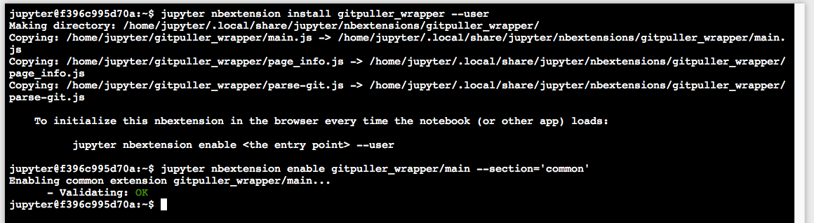

# Getting New Notebooks From Github

As there are currently over [two million jupyter notebooks](https://github.com/parente/nbestimate) on git, it is natural to ask the question "How do I use these notebooks (on Callysto)?". In this section of the manual, we will demonstrate how you can search for third party Jupyter notebooks and how to use them on your Callysto hub.

## Finding Notebooks


To find new Jupyter notebooks, first head to [github](github.com). When you navigate to that page, you will be greeted with a top search bar shown in the picture below


In that top search bar, you can enter a topic that you may find interesting. For example, if we search for "Social Science" you will be redirected to a page that appears similar to the image below


From this page, on the menu bar to the bottom left called "Languages" shown in the image below


If you click the option of "Jupyter Notebook" (highlighted here) your search results will be filtered to only repositories which contain a Jupyter notebook.

At this point you will be free to search through the repositories found to find any third-party materials that are of interest to you.


## Importing New notebooks

### Install the Extension

From your hub page click `New` $\rightarrow$ `Terminal`. As shown in the image below


After clicking `Terminal`, you'll be redirected to a terminal page that will look something like the image below


In that terminal window, copy and paste the following instructions in the order they appear below
1. `git clone https://github.com/callysto/docker-stacks.git` $\leftarrow$ tentative link (may end up on docker stack)  
2. `jupyter nbextension install gitpuller_wrapper --user`
3.  `jupyter nbextension enable gitpuller_wrapper/main --section='common'`

Once you've run those commands, the output of your terminal should look something like the image below



Once you've seen this page, close the tab that the terminal is in and return to your hub's home page and click refresh. If everything as worked, your hub will now have an additional tab called "New Notebooks" as seen in the image below.


### Getting New Notebooks

Navigate to your "New Notebooks" tab. You will be greeted by a page that that looks like the image below


To use a notebook you've found on git, simply copy-paste the github url into the text entry field and hit enter. The hub will take care of the rest.

For example, if you wanted to use our coin flipping notebook available at this link: [https://github.com/callysto/callysto-sample-notebooks/blob/workshop_demos/notebooks/Math/FlippingCoins.ipynb](https://github.com/callysto/callysto-sample-notebooks/blob/workshop_demos/notebooks/Math/FlippingCoins.ipynb). Simply copy paste that link into that text entry box and a new tab will open up. After a (usually brief) loading period, you will be redirected to an opened copy of that notebook in your hub environment.

#### Notes

This action will download the entire repository to your hub, so you will have access to everything else in the repository through your hub environments file browser. You may also just put the repo url in the text box and be directed to the file view instead.

One thing to be aware of is that this will _not_ download any additional dependencies that are not included in the repository. If while trying to run a third party notebook your notebook crashes and returns an error similar to the following

```python3
---------------------------------------------------------------------------
ModuleNotFoundError                       Traceback (most recent call last)
<ipython-input-1-37b1e8eba12f> in <module>()
----> 1 import MissingModule

ModuleNotFoundError: No module named 'MissingModule'
```
The most likely fix to this is to open a new code cell in your note book and type the following

```bash
!pip install MissingModule --user
```
where you will replace "`MissingModule`" with the name of the module you are not missing. If this command successfully installs your package, the notebook should work. If it does not, you may have to consult nay installation instructions included in the third party library.
