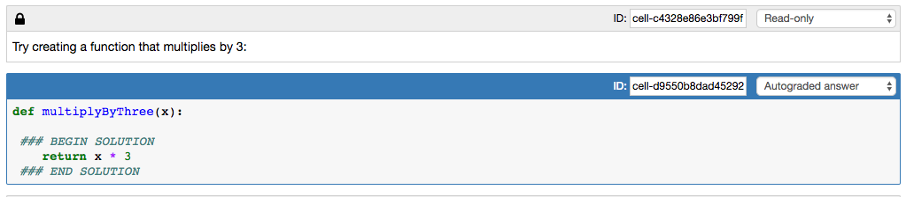
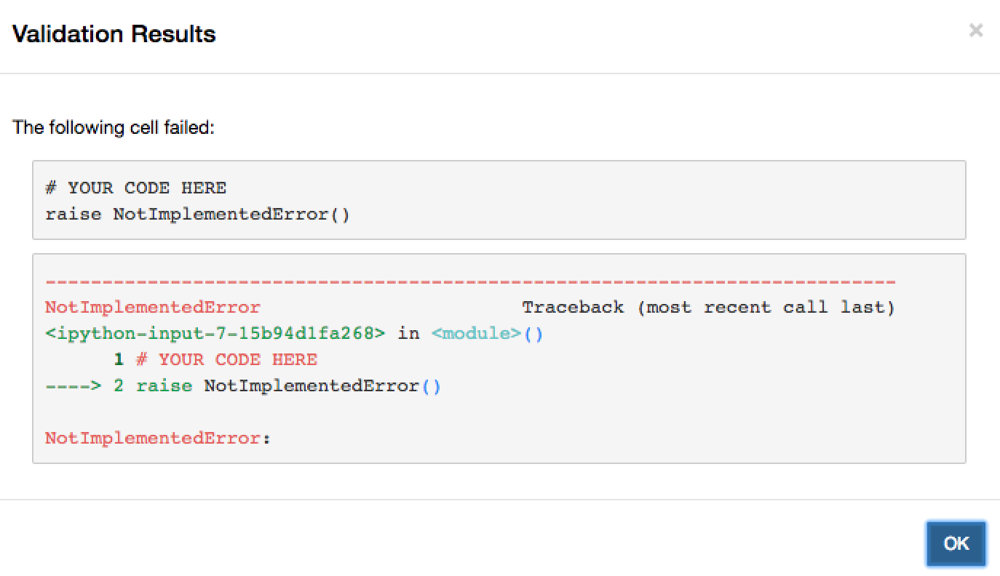
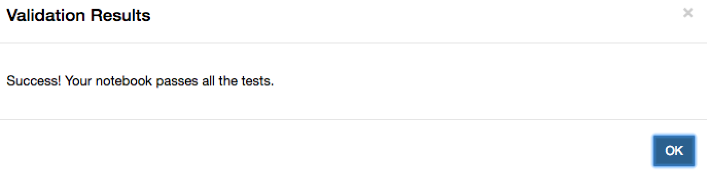

## Nbgrader

Nbgrader is a tool that allows creating, distributing and grading assignments in the Jupyter notebook.

### Documentation
We use latest version 0.5.4.
Official documentation and introductory video:

http://nbgrader.readthedocs.io/en/stable/

### Example usage

Instructors can create  assignments, copy them to shared location, collect and grade submitted assignments, manage students list.
Students can fetch assignments from the shared location, complete and submit them back.

#### Create an assignment(instructors)

Official docs: http://nbgrader.readthedocs.io/en/stable/user_guide/creating_and_grading_assignments.html

To create new assignment - click on Formgrader tab:

Some instructions on the top of the page:

Click on Add New Assignment, enter assignment name and optional due date. (For time zone only UTC is supported). If assignment is submitted past due date - it gives student a warning.(can be customized):

After the entry for assignment is created  - click on the assignment name and you can add new notebook  to the assignment.

Inside the notebook click on the View->Cell Toolbar -> Create Assignment:

After that every cell will have a little header where you can specify the cell type:

For the basic setup mark all the cells that students are allowed to modify as **manually graded answer**, all other cells - as **read only**.
For manually graded answer cells you can optionally specify the number of points student can get if the answer is correct.

For more information about cell types - see **Grading and cell types** section.

#### Generate student version/preview and release an assignment(instructors):

Official docs: http://nbgrader.readthedocs.io/en/stable/user_guide/creating_and_grading_assignments.html#assign-and-release-an-assignment

After an assignment is created and saved, you can generate student version by clicking Generate button:

When an assignment is generated successfully there is a success window pop up:

You can check generated student version by clicking Preview button:

If an assignment looks good - it can be released to shared location  - so students can fetch it. Press Release button to do it:

Once released - success widow will pop up:

### Fetch/complete and submit an assignment(students):

As a student click on the Assignments tab:

Choose the course from the list - Course3 in our example:

Click Fetch and assignment will be copied to students home directory:

Click on the notebook name under the assignment name to be able to complete it:

Complete the assignment and save it.

Once you are ready to submit an assignment  - click Submit button.
(For Validate button see **Validate notebook** section)

An assignment can be submitted multiple times.

#### Collect/autograde and manually grade assignments (instructors):

Official docs: http://nbgrader.readthedocs.io/en/stable/user_guide/creating_and_grading_assignments.html#releasing-files-to-students-and-collecting-submissions

Click Collect to get student's submission from shared location:

If there is new submission on shared location  - message pops up that new submission is collected/updated.

If there are no new submissions:

Once new submissions are  collected - click on the number of submissions to start grading:

New submissions automatically go to the state "needs autograding". Click on autograde button.

Message if autograding is successful:

If there are cells that need manual grading in the assignment  -  submission will go into "needs manual grading state":

Click on student's name(For students name :None/None - see **Manage students** section) and on the notebook's name to start manual grading:

For manually graded cells you can click on "Full credit/No credit" button to assign points or enter the number of points manually. In addition you can leave some comments that will carry on to the next submissions from the same student (visible only to instructors):

After you are done manual grading - click on the next button in the top right corner:

You will see that submission was graded.

### Manage students (instructors):

Student list (StudentId, last Name, first name, email) can be created in advance using Manage Students tab:

If there is a submission from student who is not in the list  - his last name/fist name will be set to None/None by default, can be updated through Manage students tab:

Click on Edit Student button:

A window pops up where all the student information can be filled in:

Click Save and student information will be updated in the list:

### Additional feature - Collect All (instructors):

If a student has submitted an assignment multiple times - all the submitted assignments are stored on the shared location.
When an instructor collects assignments - only the latest submission is copied to the instructor's home directory and graded.
"Collect All"  allows to copy all the assignments submitted in the past to the instructor's home directory.
If there are some submissions to copy - the list of submissions will be displayed:

If all existing submissions are copied already  - message will be displayed:

The assignments are copied to ~/<Course_name>/submitted_history/<assignment>/<studentID_timestamp> directory on the instructor's container:

Timestamp is UTC time(can be customized).

### Extra information:

**Installation**  - this section is for reference only (everything will be preinstalled in advance).

**Grading and cell types**  - this section can be used for more advanced grading process.

**Validate notebook**  - there is an option for notebook validation before submitting for students.

**Modify released assignment** - this section is about modifying an assignment that was already released and fetched by students.

#### Installation (instructors and students):

1. To install updated version of nbgrader("Collect All" added):

`!pip install --user  git+git://github.com/cybera/nbgrader.git@cybera-changes
`

To install original version:

`!pip install --user nbgrader`

2.  Enable extension:

`!jupyter nbextension install --user --py nbgrader --overwrite`

`!jupyter nbextension enable --user --py nbgrader`

`!jupyter serverextension enable --user --py nbgrader`

3. Create directory for course that you will be managing(for instructors):
 `!makedir Course3`

4. Create config file for nbgrader ~/.jupyter/nbgrader_config.py in your home directory:

 - For **instructors** we need to specify the shared location to distribute/collect assignments and course name (in this example shared location is /tmp/sharedvolume, instructors home directory is /home/teacher5/  and course name is Course3):

`c = get_config()`  
`c.Exchange.course_id = "Course3"`    
`c.CourseDirectory.root = '/home/teacher5/Course3'`    
`c.Exchange.root = "/tmp/sharedvolume"`     

- for **students**  we need to specify shared location:

`c = get_config()`  
`c.Exchange.path_includes_course = True`  
`c.Exchange.root = "/tmp/sharedvolume" `  

5. Restart server.

#### Grading and cell types (instructors):

Inside the notebook click on the View->Cell Toolbar -> Create Assignment:

After that every cell will have a little header where you can specify the cell type:

For **code** cells you can choose between:
- Manually graded answer
- Autograded answer
- Autograded tests
- Read-only
- none

For **markdown** cells  the choices are:
- Manually graded answer
- Read-only
- none

**Read-only** cells  - students will not be able to edit these cells:

**Manually graded answer** cells - instructor needs to open the submission and check answers visually (most common use case are  written free-response answers or plots):

**Autograded answer** cells - this cell will be autograded to check if the code is there.

**Autograded tests** cells - this cell will run and autograde tests (must contain `assert` statement):

The tests between `### BEGIN HIDDEN TESTS` and `### END HIDDEN TESTS`  are not visible to students

For autograded/manually graded answer - the code will be hidden in student version, there is a prompt to insert your code here and raise NotImplementedError() if the implementation was not added (need to be commented out once doe is there):

Examples of assignments:

http://nbgrader.readthedocs.io/en/stable/user_guide/source/ps1/problem1.html
http://nbgrader.readthedocs.io/en/stable/user_guide/source/ps1/problem2.html

#### Validate notebook (students):

Before submitting completed assignment back  - you can click Validate button to check if all the autograded tests  pass and code is there for manually graded cells:

In case of error - error window will pop up:

In case of success - success window:

Note, by default it will allow to submit notebooks even if the don't pass validation.(can be customized)

#### Modify released assignment(instructors and students):

If the assignment was already released but need to be modified - press cross button (Unrelease)

Assignment will be removed from shared location.

Modify, generate students version and release again.

For students to be able to fetch modified assignment - they need to delete exiting assignment directory first:

