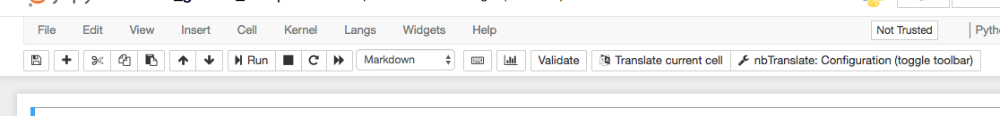
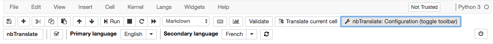
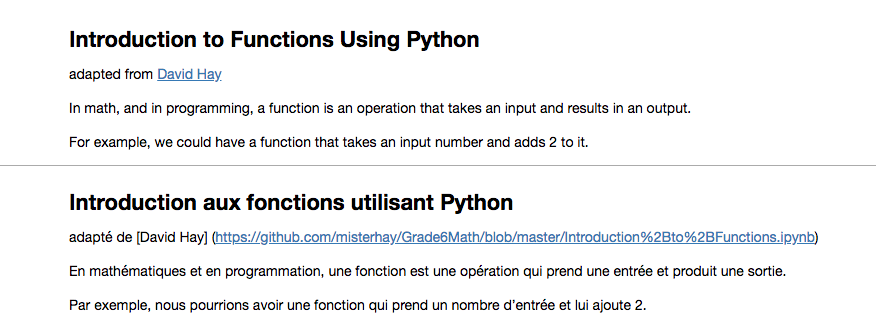
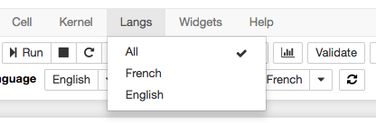

Github:
https://github.com/ipython-contrib/jupyter_contrib_nbextensions/tree/master/src/jupyter_contrib_nbextensions/nbextensions/nbTranslate

### Installation:

(Tested on winning-manatee):
 - Create new user
 - Start server (create docker container)
 - ssh to the server, attach docker container and run as root:

`jupyter nbextension install https://rawgit.com/jfbercher/jupyter_nbTranslate/master/nbTranslate.zip --user`

`jupyter nbextension enable nbTranslate/main`

 - Restart server

 - If using LaTeX run following commands from Jupyter notebook to upgrade:  
  (*LaTeX environments are protected before conversion and restored after. For environments with text content, e.g. theorem, remark, etc, the content is still translated. Some minor updates have been applied to latex_envs to ensure the best compatibilty*)

 `!pip install jupyter_latex_envs --upgrade --user`  
 `!jupyter nbextension install --py latex_envs --user`  
 `!jupyter nbextension enable latex_envs --user --py`  

### Usage:

#### To configure:
Click **nbTranslate: Configuration (toggle toolbar)** in the menu

nbTranslate toolbar will appear down in the menu:

Choose **primary language** - the language to translate from (English).  
Choose **secondary language** - the language to translate to (French).  
Set checkmark to use google translate.  
Click **close the nbTranslate configuration toolbar** button on the right.  

#### To translate:
Click **Translate current cell** button in the menu or **nbTranslate** button in the nbTranslate configuration toolbar

The second(translated) cell will be created under the original cell.

#### To use translated version:

##### Option1:
 - install nbTranslate extension for every student;
 - have double cells for every notebook - English and French;
 - students can choose from the menu which language to display (English, French or both).
 

##### Option2:
 - After the translation - delete all original english cells and save the notebook under different name;
 - Students don't have to have nbTranslate extension installed;
 - French and English versions - will be two separate notebooks.
